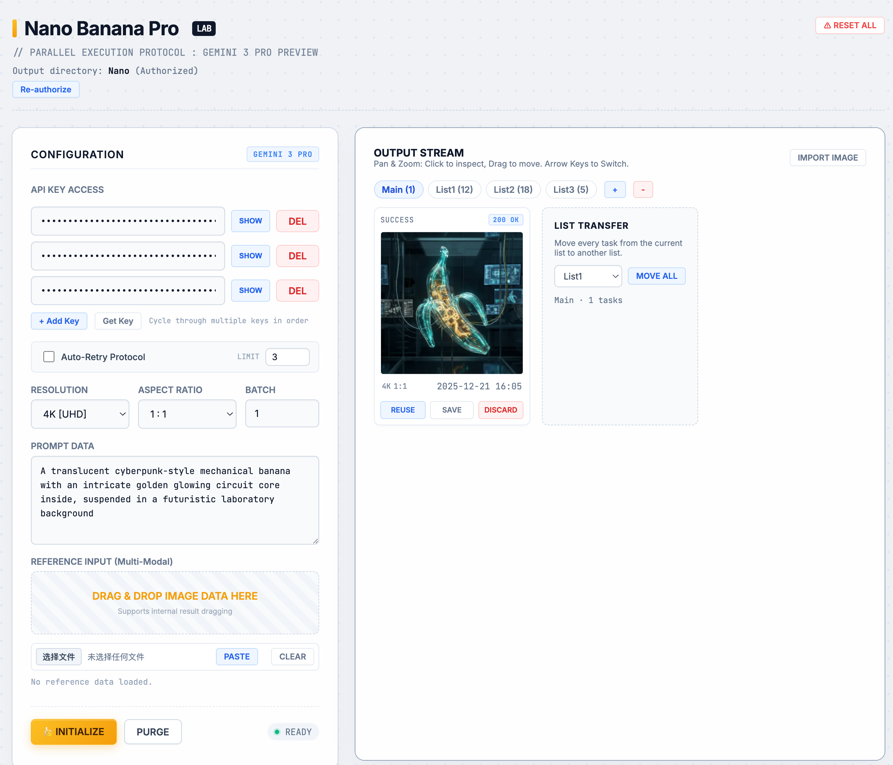

# Nano Banana Pro | Future Lab Edition 🍌

**The Ultimate Single-File Interface for Gemini 3 Pro Image.**

**Nano Banana Lab** is a serverless, local-first "Lab Environment" for power users utilizing Google's Gemini 3 Pro image generation model. It combines the simplicity of a single HTML file with the power of a desktop-class asset management system.

It features **direct disk synchronization**, **advanced batching**, **multimodal reference injection**, and a **persistent local database**.

> **⚠️ System Requirement:** Requires a **Chromium-based browser** (Chrome, Edge, Brave, Opera) on Desktop to leverage the *File System Access API*. Firefox and Safari are not currently supported.

---

## UI Preview

  

---

## ⚡ Core Features

### 1. Zero-Install & Serverless

The entire application lives in one file: `nano.html`. No Node.js, Python, or Docker required. Just download, open, and generate.

### 2. Direct Disk Sync (The "Hard Link")

Unlike web apps that dump files into "Downloads," Nano Banana Pro binds directly to a folder on your drive.

* **Real-time Saving:** Images are written to disk instantly upon generation.
* **Metadata Pairing:** Every image is saved with a matching `.json` file containing the prompt, parameters, and timestamps.
* **Two-Way Sync:** The app reads your folder state on startup, syncing your local library with the browser view.

### 3. Parallel Execution Protocol

* **Batch Processing:** Generate up to **20 images** simultaneously.
* **API Key Rotation:** Add multiple Google API Keys. The system automatically cycles through them to maximize throughput and manage rate limits.
* **Auto-Retry:** Built-in exponential backoff handles network glitches or API overloading automatically.

### 4. Hybrid Persistence Layer

* **IndexedDB Cache:** A high-performance local database caches your session, allowing you to load thousands of past results without cluttering memory.
* **State Recovery:** Accidentally closed the tab? Pending tasks and unread results are restored instantly upon reopening.

---

## 🎮 Pro Workflow & Hidden Features

Nano Banana Pro is packed with hidden interactions designed for speed.

### 📂 Advanced List Management

* **Create & Delete:** Create unlimited lists to organize projects (e.g., "Concepts", "Finals").
* **Drag-to-Reorder:** **Drag the list tabs** themselves to reorder your workspace.
* **Drag-to-Move:** Drag a result card and drop it onto a specific List Tab to move it there.
* **Quick Rename:** **Double-click** any list tab to rename it instantly.
* **Mass Migration:** Use the "Move All" widget at the bottom of the stream to bulk-transfer tasks between lists.

### ⌨️ Keyboard Shortcuts (The "Lab Secrets")

Master the interface with these undocumented hotkeys:

| Key | Action | Description |
| --- | --- | --- |
| **`Q`** | **Quick Locator** | Instantly scrolls to and highlights the last viewed image in the feed. |
| **`J`** | **Jump to Ref** | Switches the active view to the `REF` (Reference) list immediately. |
| **`Esc`** | **Close / Cancel** | Closes the Lightbox or cancels the Import dialog. |
| **`←` / `→`** | **Navigation** | Navigate through images inside the Lightbox. |
| **`Z`** | **Zoom In** | Incrementally zoom into the image (Lightbox only). |
| **`X`** | **Zoom Out** | Incrementally zoom out (Lightbox only). |
| **`C`** | **Center/Reset** | Reset zoom level to 100% (Lightbox only). |

### 🖱️ Drag & Drop Mechanics

* **External Import:** Drag images from your OS into the generation panel to use them as **References**.
* **Self-Referencing:** Drag a *generated result* back into the "Reference Input" zone to iterate on a style.
* **Sort & Organize:** Drag result cards to reorder them visually within the stream.

---

## ⚙️ Configuration Guide

1. **API Key Setup:**
* Get your key from [Google AI Studio](https://aistudio.google.com/app/apikey).
* Enter it in the "Configuration" panel.
* *Tip:* Click `+ Add Key` to input multiple keys for heavy batch workloads.

2. **Reference Inputs (Multimodal):**
* Supports `image/png`, `image/jpeg`, and `image/webp`.
* **Limit:** Up to 14 reference images per generation task.
* **Prompting:** The model treats these as visual context. Use the prompt to describe how to use them (e.g., "Use the composition of image 1 and the style of image 2").

3. **Output Files:**
* Images are saved as `nano-{timestamp}-{random}.png`.
* Metadata is saved as `nano-{timestamp}-{random}.json`.

---

## 🛠️ Troubleshooting

**"Output directory not bound"**

* Browsers reset file permissions on restart for security. You must click the "Re-authorize" button in the header each time you open the app.

**"Quota Exceeded" (429 Error)**

* This means you hit the Google API rate limit.
* **Solution:** Add more API keys to the rotation pool or enable "Auto-Retry" in settings.

**"Reset All"**

* The hidden **⚠ RESET ALL** button (top right) performs a factory reset. It wipes `LocalStorage` (settings/keys) and `IndexedDB` (history). Use with caution.

---

## 🔒 Privacy & Architecture

* **Local-First:** All logic runs in your browser.
* **Direct Connection:** Requests go directly from your browser to `generativelanguage.googleapis.com`. No middleman servers.
* **Data Ownership:** Your keys and images never leave your control.

---

## 📄 License

**MIT License**. Open source and free to modify.
*Built with Vibe Coding.*
